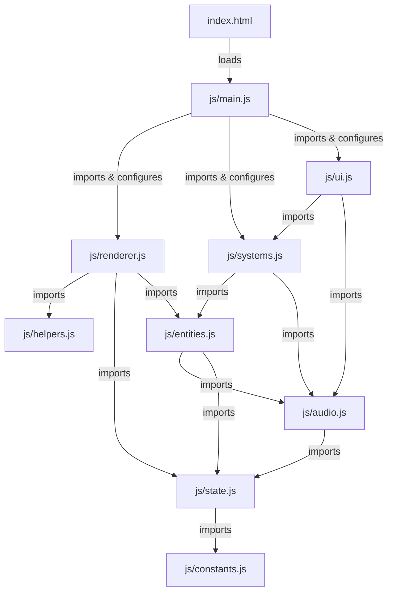

# System Architecture & Design Patterns

This document details the software architecture, design patterns, and engineering decisions implemented in the **Zombie Survivor - Tactical Command PC** game.

---

## 1. ES Modules & No-Build Architecture

The application is built entirely on native web technologies:
- **No Bundlers**: It uses browser-native `<script type="module">` loading.
- **Dependency Flow**: Imports always use explicit local paths (e.g., `import { ... } from './state.js';`) with file extensions.



---

## 2. Resolving Circular Dependencies (Event Hooks Pattern)

In a typical modular game, entities (like zombies or drops) need to trigger global system changes (like spawning blood on the background, awarding gold, updating the HUD, or saving the game). Conversely, systems need to spawn entities. 

Directly importing `systems.js` or `ui.js` inside `entities.js` would create a circular dependency loop, leading to **Temporal Dead Zone (TDZ) ReferenceErrors** at startup.

### The Solution: Event Hooks Registry

We declare empty hook registries in the low-level modules, which are then populated by the top-level entry module (`main.js`) once all modules have loaded.

#### Example: `js/entities.js` declares hooks
```javascript
export const hooks = {
    dispatchDOMUpdates: null,
    checkWaveFinished: null,
    addGold: null,
    addBloodSplatterToBg: null
};
```

#### Example: `js/main.js` binds them at startup
```javascript
import { hooks as entityHooks } from './entities.js';
import { dispatchDOMUpdates } from './ui.js';
import { checkWaveFinished } from './systems.js';
import { addBloodSplatterToBg } from './renderer.js';

entityHooks.dispatchDOMUpdates = dispatchDOMUpdates;
entityHooks.checkWaveFinished = checkWaveFinished;
entityHooks.addBloodSplatterToBg = addBloodSplatterToBg;
```

#### Example: `js/entities.js` invokes them safely
```javascript
if (hooks.addGold) {
    hooks.addGold(this.goldReward);
}
```

---

## 3. Pseudo-3D Perspective Projection

The game renders a 3D tactical command view on a 2D canvas using a perspective math projection. 

### The Math Model
All coordinates in entities are stored in **world coordinates** where:
- `worldX`: Horizontal position (0 to `canvas.width`).
- `worldY`: Vertical position (depth). `-50` represents the far horizon, while `barricadeY` (`canvas.height - 170`) is the foreground.
- `worldZ`: Height above the ground (used for bombs, airdrops, jumping effects).

### The Projection Function (`js/helpers.js`)
```javascript
export function project3D(worldX, worldY, worldZ = 0) {
    if (!canvas) return { x: worldX, y: worldY, scale: 1.0 };
    const horizonY = canvas.height * 0.24;
    const barricadeY = canvas.height - 170;
    const vanishingX = canvas.width / 2;
    
    // Normalize Y between horizon and barricade
    const minY = -50;
    const factor = Math.max(0, Math.min(1, (worldY - minY) / (barricadeY - minY)));
    
    // Scale factor: closer elements are rendered larger (up to 1.1x)
    const scale = 0.35 + factor * 0.75;
    
    const screenX = vanishingX + (worldX - vanishingX) * scale;
    const screenY = horizonY + factor * (barricadeY - horizonY);
    const screenYWithZ = screenY - worldZ * scale; // Adjust for height Z
    
    return { x: screenX, y: screenYWithZ, scale: scale };
}
```

---

## 4. Dual Audio Engine (Tone.js + Audio Pools)

To provide an immersive sci-fi atmosphere without lag, the audio system uses a dual-engine architecture:

1. **Synthesized UI & Ambient (Tone.js)**:
   - Uses synthesized sounds (e.g., PolySynth, Frequency modulation) to generate clean futuristic tones for menus and wave triggers.
   - Initialized only after the user's first click to comply with browser autoplay policies.
2. **High-Fidelity Combat SFX (Audio Pools)**:
   - To play rapid weapon fire (like SMG or Gatling gun) without choking the browser, we use pre-instantiated HTML5 `Audio` objects stored in array pools (`realisticAudioPools`).
   - Every audio file has `POOL_SIZE_PER_SOUND` instances (default: `8`) that are cycled through (`playRealisticSound`), ensuring sound clips overlap cleanly rather than truncating each other.
